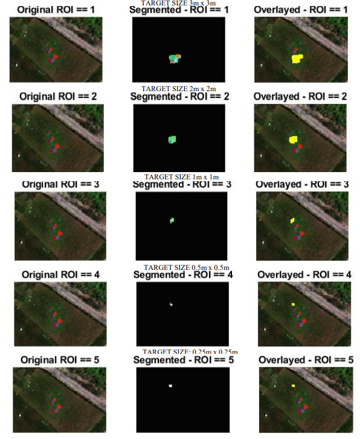
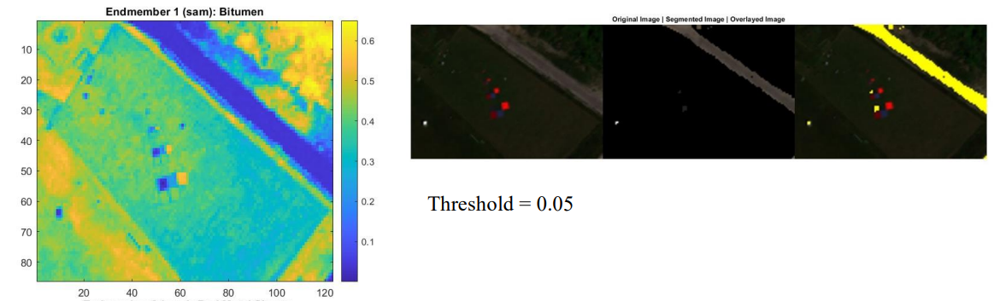
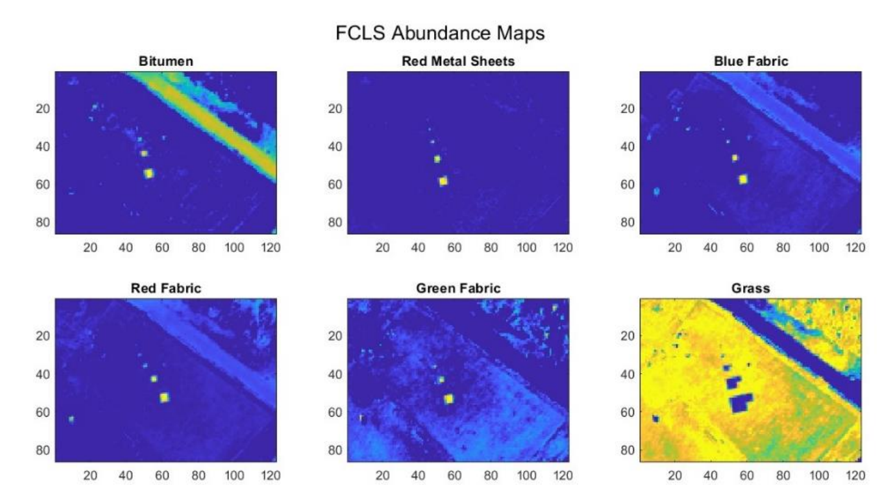
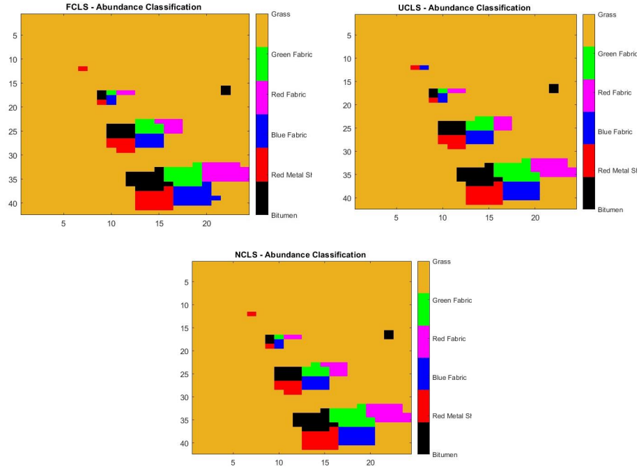

# Spectral Unmixing (MATLAB) — DLR HySU Benchmark (A.Y. 2022/2023)

MATLAB project implementing a **modular Spectral Unmixing pipeline** for **hyperspectral remote sensing**, developed for the _Computer Vision: Image Processing_ technical report at **Politecnico di Bari** (M.Sc. in Computer Engineering — _Artificial Intelligence & Data Science_, A.Y. 2022/2023).

The implementation focuses on **Linear Spectral Unmixing (LSU)** under the **Linear Mixing Model (LMM)** and follows the standard unmixing workflow:

1. **Dimensionality estimation / reduction** (optional, depending on the experiment)
2. **Endmember determination** (extraction)
3. **Inversion** (abundance estimation) + evaluation and visualization

---

## Abstract

Spectral unmixing aims to decompose each pixel spectrum into a set of **pure spectral signatures** (_endmembers_) and their **fractional abundances**. This is particularly relevant in hyperspectral remote sensing, where mixed pixels are common due to limited spatial resolution.

This project integrates a set of geometric and least-squares methods to:

- build hyperspectral data cubes from ENVI-compliant imagery
- estimate the number of materials present in a scene
- extract endmembers (N-FINDR, PPI)
- match signatures (SAM, SID)
- estimate abundances (FCLS, UCLS, NCLS)
- generate abundance maps and a maximum-abundance classification

---

## Dataset

Experiments are conducted on the public benchmark dataset:

**DLR HySU — A Benchmark Dataset for Spectral Unmixing**  
Official page (download + documentation):  
https://www.dlr.de/eoc/en/desktopdefault.aspx/tabid-12760/22294_read-73262/

The dataset provides:

- **Airborne hyperspectral imagery** acquired by **HySpex** pushbroom cameras
- **High-resolution RGB imagery** acquired by a **3K RGB** camera system
- **Spectral libraries**:
  - image-derived HySpex spectral library
  - in-situ **SVC field spectrometer** spectral library (ground truth)
- ROI annotations/masks (e.g., `masks.mat`) for target localization and target-size grouping

HySpex subsets referenced in the report and supported by the code:

- `Full` (86×123)
- `All Targets` (42×24) + masked variant
- `Large Targets` (13×16)
- `Small Targets` (12×12)

---

## Requirements

### Software

- **MATLAB** (recent version recommended)

### MATLAB Toolboxes / Add-ons

Install from MATLAB Add-On Manager:

- **Image Processing Toolbox — Hyperspectral Imaging Library**
- **Mapping Toolbox**

External helper (MATLAB File Exchange):

- **read_envihdr** (ENVI `.hdr` parsing)

---

## Reproducibility — Quick Start

### 1) Download and place the dataset

### 2) Run the pipeline

Open and run:

- `Main.mlx`

The main live script calls each module in `Functions/` following the workflow described in the technical report.

---

## Pipeline Overview (Modules)

### 1) Targets Detection & ROI Visualization — `TargetsDetection.mlx`

Uses DLR-provided ROI masks (`masks.mat`) to:

- visualize targets grouped by **size** (`targetsROI`)
- visualize targets grouped by **material** (`materials`)
- produce: RGB views, segmented ROIs, and overlay visualizations

---

### 2) Spectral Libraries Parsing — `SpectralLibraries.mlx`

Loads and compares spectral libraries:

- HySpex library (image-derived)
- SVC library (in-situ ground truth)

Outputs:

- reflectance curves over **135 bands** (~417–903 nm)
- consistent endmember naming and plotting colors (aligned with the report)

---

### 3) Manual Pure-Pixel Signature Extraction — `SpectralSignaturesExtraction.mlx`

Interactive endmember signature extraction by selecting pixels on RGB visualization:

- supports pure-pixel selection (typically near the target center)
- builds a custom spectral library aligned to the DLR format
- compares extracted signatures against DLR libraries for validation

---

### 4) Hypercube Construction & Visualization — `Hcube.mlx`

Builds `hypercube` objects from ENVI-compliant `.tif` + `.hdr` pairs for:

- `Full`, `All`, `Large`, `Small`

Also provides standard hyperspectral visualizations:

- RGB rendering
- contrast stretching
- false color
- CIR (color infrared)

---

### 5) Dimensionality Estimation — `DimensionalityEstimation.mlx`

Estimates the number of endmembers using **HFC** across multiple **PFA** values:

- produces a results table (dataset × PFA)
- supports selection of dataset/PFA for subsequent endmember extraction

---

### 6) Endmember Extraction — `EndmembersExtraction.mlx`

Compares two classic geometric methods:

- **N-FINDR** (simplex volume maximization via determinant-based criterion)
- **PPI** (Pixel Purity Index, extreme-pixel counting via random projections)

Outputs:

- extracted endmember signatures
- comparison against manually extracted signatures

Report-consistent observation:

- materials with weak/ambiguous absorption features (e.g., **bitumen**) can be challenging, especially under mixed-pixel conditions.

---

### 7) Metrics on Extracted Endmembers — `ComputeMetrics.mlx`

Quantitative evaluation of extracted endmembers vs the manual reference:

- **RMSE**
- **RMSPE**
  (using min–max normalization prior to metric computation)

---

### 8) Spectral Matching — `SpectralMatching.mlx`

Pixel-wise spectral matching against reference signatures using:

- **SAM** (_Spectral Angle Mapper_)
- **SID** (_Spectral Information Divergence_)

Outputs:

- distance score maps
- threshold-based segmentations
- overlay visualizations

Qualitative behavior consistent with the report:

- SAM can be effective with appropriate thresholds.
- SID may struggle when materials share similar spectral distributions.

---

### 9) Abundance Estimation — `AbundanceMaps.mlx`

Abundance estimation via least-squares inversion (`estimateAbundanceLS`) using:

- **FCLS** (non-negativity + sum-to-one constraints)
- **UCLS** (unconstrained)
- **NCLS** (non-negativity constraint)

Outputs:

- abundance maps per endmember and per method

---

### 10) Maximum Abundance Classification — `AbundanceClassifier.mlx`

Applies **Maximum Abundance Classification (MAC)**:

- assigns each pixel to the endmember with maximum abundance
- generates a single color-coded classification map

---

## Methods & Tools Used (Summary)

### Spectral Unmixing / Hyperspectral Processing

- Linear Mixing Model (LMM) + Linear Spectral Unmixing (LSU)
- Dimensionality estimation: HFC (PFA sweep)
- Endmember extraction: **N-FINDR**, **PPI**
- Spectral matching: **SAM**, **SID**
- Abundance estimation: **FCLS**, **UCLS**, **NCLS**
- Classification: **MAC**

### MATLAB Functions (Hyperspectral Imaging Library)

- `hypercube`
- `nfindr`
- `ppi`
- `spectralMatch`
- `estimateAbundanceLS`

---

## Figures

**Targets ROI overlay**

**Manual vs DLR spectral signatures**

**SAM matching example (Full subset)**

**Abundance maps (FCLS example)**

**Maximum Abundance Classification (MAC)**

---

## References

- Cerra et al., _DLR HySU—A Benchmark Dataset for Spectral Unmixing_, Remote Sensing, 2021.
- DLR HySU dataset page: https://www.dlr.de/eoc/en/desktopdefault.aspx/tabid-12760/22294_read-73262/

---

## Authors

- Germano Pansini
- Pierluigi Longo

Polytechnic University of Bari — Department of Electrical and Information Engineering (DEI) — A.Y. 2022/2023
